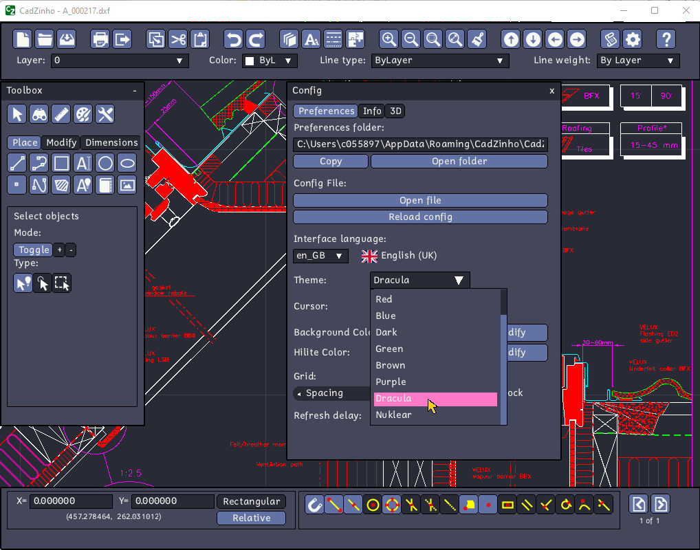

### [CadZinho](https://github.com/zecruel/CadZinho)

Dracula theme cames with [CadZinho](https://github.com/zecruel/CadZinho).

To install [CadZinho](https://github.com/zecruel/CadZinho), see [https://github.com/zecruel/CadZinho/wiki/Installation](https://github.com/zecruel/CadZinho/wiki/Installation).

#### Activating theme

1. Do this:
   
2. Boom! It's working ✨
